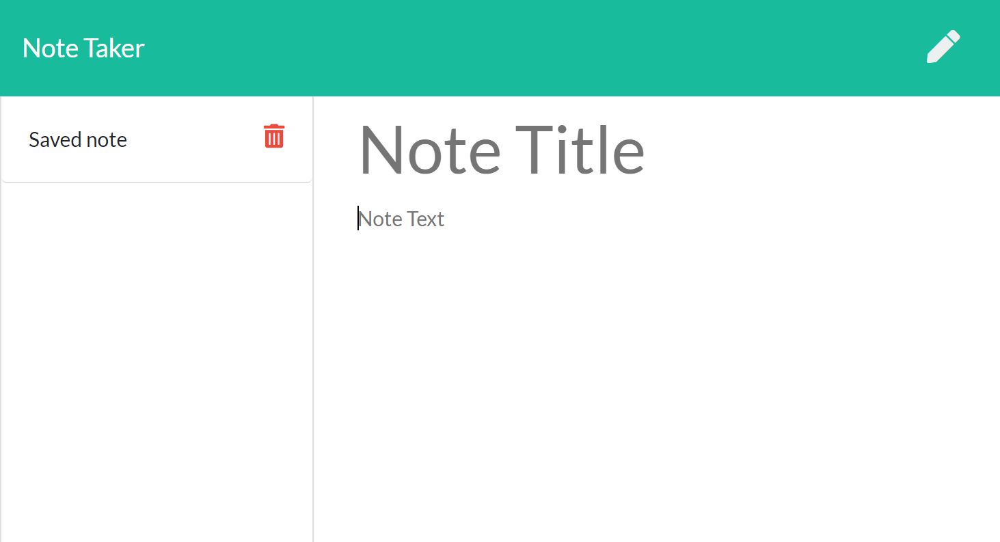

# Express Note Taker

## Description
---
[](https://opensource.org/licenses/MIT)


An application that can be used to write, save, and delete notes. This application uses an `express` backend and save and retrieve note data from a JSON file.

Deployed with heroku at https://note-taker-cbr.herokuapp.com/


---

## Table of Contents 

* [Installation](#Installation)
* [Usage](#Usage)
* [Credits](#Credits)
* [License](#License)
* [Questions?](#Questions?)

---
## Installation

After downloading the repository, navigate to the project directory and run the following command in bash:
```
npm install
```
This will install all the dependencies for the project specified in `package.json`.

If you want to install these dependencies individually you can run the following:
- `npm i express`
- `npm i fs`
- `npm i path`
- `npm i util`

To run the app locally, navigate to the `Develop` directory and enter the command
```
npm start
```
and open your browser to the port specified.

## Usage

This projects purpose was to provide the user with a note-taking app that saves it's data on a server to avoid excessive local storage. 

## License

© 2020 [Clyde Baron Rapinan](https://github.com/clydebaron2000). Under the [MIT](https://opensource.org/licenses/MIT) license.

## Contributing

Anyone can contribute to this project.

## Questions?

Have questions about my project? [Email me](mailto:clydebaron2000@gmail.com) at clydebaron2000@gmail.com.

---
Check out my other projects [here!](https://github.com/clydebaron2000)